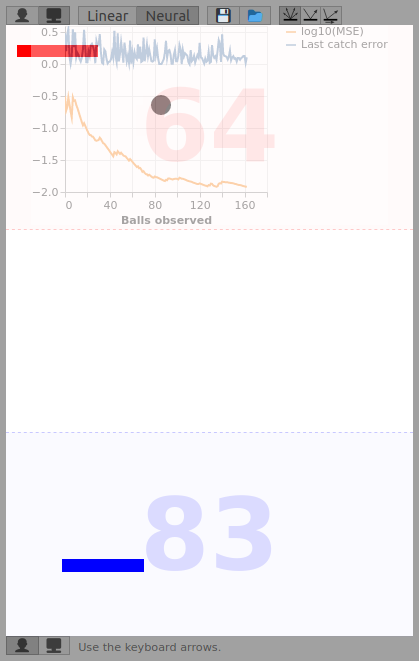

# Neural Tennis JS

This [Pong](https://en.wikipedia.org/wiki/Pong) clone features some A.I. It was created as an exercise in:
- TensorFlow JS and neural networks.
- Angular, TypeScript, Sass.
- Workers.
- Touch API and multitouch.
- Fullscreen API.
- SVG.

## Demo
Live demo: [https://inkin.ru/software/neural-tennis-js/demo/](https://inkin.ru/software/neural-tennis-js/demo/)

## Controls:
Keyboard:
- Blue Player: Keyboard arrows.
- Red Player: A, D, W, S (turn off A.I. first).
- Pause: Escape.
- Full Screen: Enter.

On touchscreen devices:
- Touch the field to move.
- Touch the center area to show Pause and Full Screen buttons.

## A.I. Features

A.I. can play for any of the players, all of the players or none.
Turn it on or off using buttons above and below the fields.

### Tracing the ball

A.I. has two models to trace the ball, and you can switch the two:
- Linear model uses extrapolation to see where the ball will end up, and moves there. It is perfect in that.
- Neural model initially gives random predictions but learns gradually. It starts to get it right after observing 100 balls and usually plays good after 200 balls.

### Neural network prediction quality

A neural network starts with random weights. It may suffer from the [dead ReLU problem](https://datascience.stackexchange.com/questions/5706/what-is-the-dying-relu-problem-in-neural-networks) and hardly learn much. Or it may learn quickly.

The chart shows the neural network progress. One line shows how bad the last position was predicted. The other one shows log10 of the mean standard error among learned balls. As the log10(MSE) approaches -2 and goes below, it is pretty good.

If the log10(MSE) did not go below -1.5 after 50 balls and is not sloping down, then the network had poor initial weights and many dead neurons, and reloading the game should help.

To have fun, train the network against the Linear extrapolation model, then take over and see how the network picks your style as well.

### Kicking the ball

A.I. has three models to kick the ball once it gets near, you can switch between them:
- Kick in a random direction.
- Kick front so the ball tilt does not change.
- Kick sideways to increase the tilt.

Any kick model can run with any tracing model.

### Saving and loading the neural network

To save your time you may load pre-trained network from the `pre-trained` directory. You may also save the network. Use the buttons above and below the field. They are visible when the network is in control.

The format is JSON with all the observed balls and current network weights.

The network layout is hardcoded. If you change it, you will not be able to load model dumps saved from models with other layouts.

## Architecture

The core object is `Engine`. It creates the players, the balls, and the models, and it ticks time.

On each `tick()` the engine moves objects, checks for collisions, and checks for goals.

Each player has both manual and A.I. control models associated with them with one being active at the time.

Each A.I. control model in turn has 2 'catch' models and 3 'kick' models, they are switched with the buttons.

Each player's neural network is trained in a separate worker so that it does not slow down the UI. With each new observed ball `NeuralCatchModel` sends all historical data to the worker to re-iterate the training.

As we need predictions fast, we cannot wait for the network in the worker as it might be training. For that purpose `NeuralCatchModel` has a local copy of the same network which it uses for predictions. Each time the network in the worker finishes training, the worker sends new weights back to `NeuralCatchModel`, and the local model gets updated.

## Things to try if I or you have time

- Speed up the learning against another A.I. player. Such a simulation does not have to run in real time for humans with redrawing players and balls.
- `NeuralKickModel` would be fun. It should use another neural network to determine kick direction. Gradually it would learn to kick to the farthest corner from the opponent.
- Allow to change the network layout at runtime. Allow to load networks from dumps with different layouts.
- Experiment with activation functions as currently ReLU can produce dead neurons. There's a nasty workaround involving calling `MyTensorFlowLib.isTrainable()` which prevents the entire network from starting up dead but many neurons are out of play anyway.
- Convert to a native app.

## How to Run

To build the project locally, you need to install Angular: https://angular.io/guide/setup-local

After that you can run development server or create a production build to upload static files anywhere. 

### Development server

Run `ng serve` for a dev server. Navigate to `http://localhost:4200/`. The app will automatically reload if you change any of the source files.

### Build

Run `ng build` to build the project. The build artifacts will be stored in the `dist/` directory. Use the `--prod` flag for a production build.
